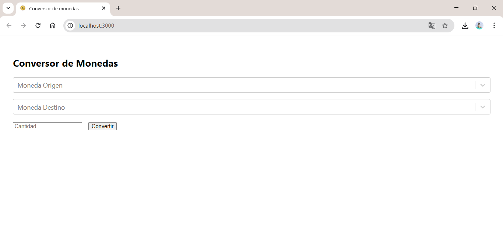

# 🪙 Conversor de Monedas - Frontend

Aplicación web desarrollada en React que permite convertir monedas en tiempo real. Se conecta a un backend propio que a su vez consume una API externa de tasas de cambio.

## 🎬 Vista previa




## 🚀 Tecnologías usadas
- React
- react-select
- Fetch API
- CSS básico

## 🌍 Funcionalidad
- Selección de moneda origen y destino
- Ingreso de cantidad
- Resultado inmediato desde backend
- Validación de campos y control de errores

## 📦 Instalación

```bash
git clone https://github.com/jeiner21/conversor-frontend.git
cd conversor-frontend
npm install
npm start
